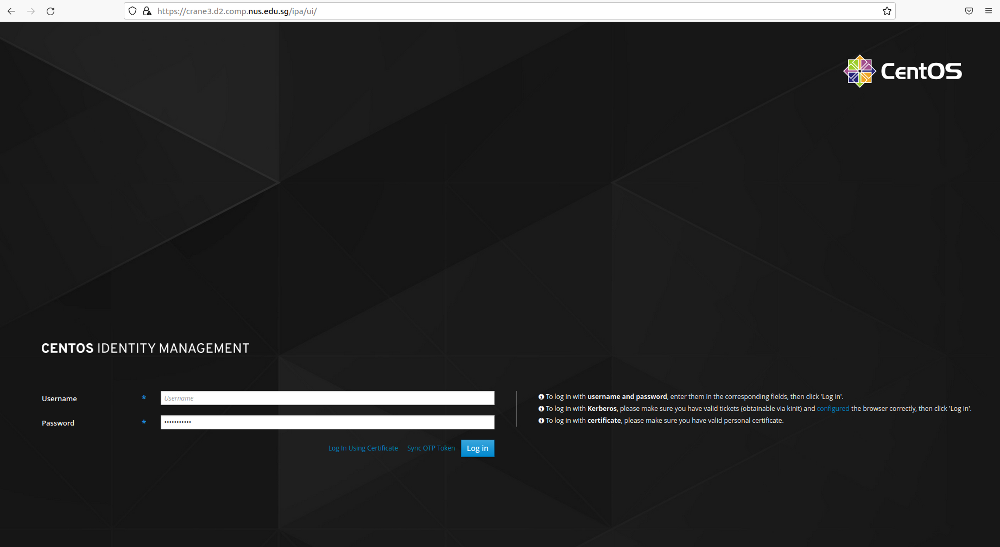
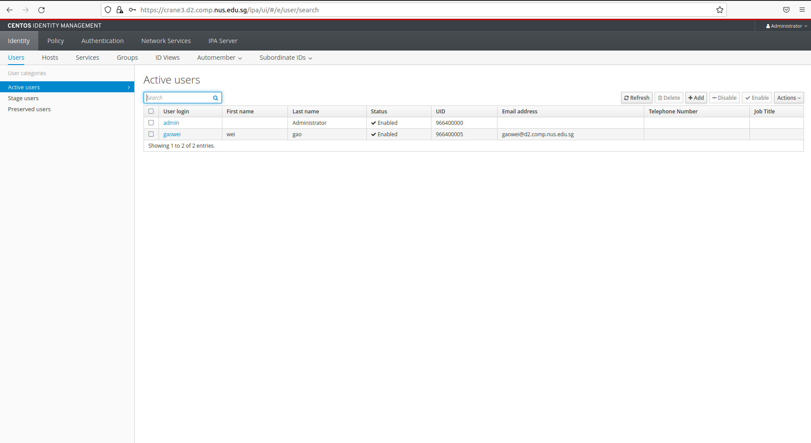
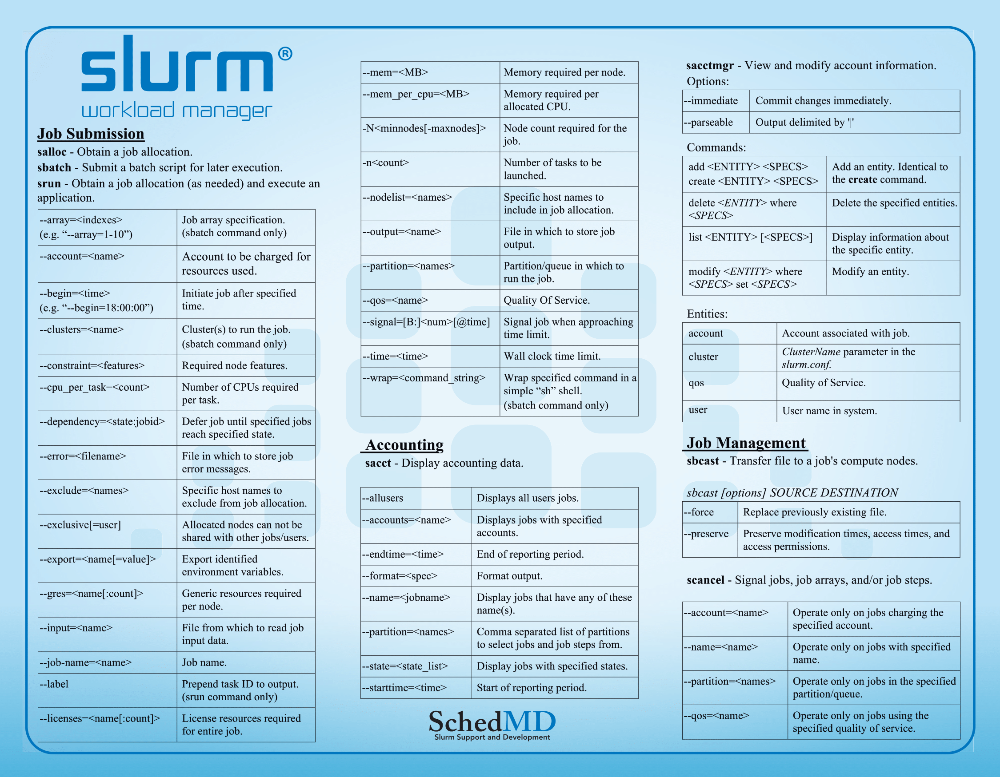
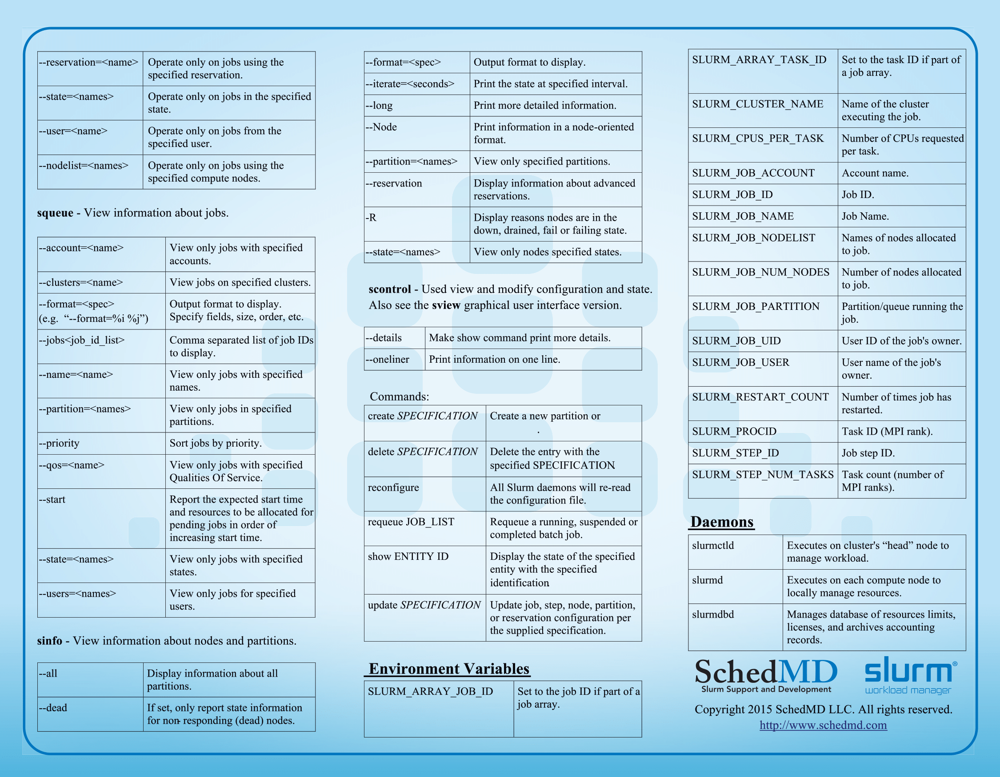

# This is the slurm system for adacomp.
For setup, refer to setup/README.md.
This readme focus on usage.
## For administrator
you can maintain the users with Web UI. [link](https://crane3.d2.comp.nus.edu.sg/ipa/ui). Note that you can use any password to create the account, the User must change password at next logon setting.



The user editing UI:


Any user created/deleted through freeipa will be synchronized across all the machines. But here, I only recommend to use master machine(crane3) to handle all your jobs via slurm.

## For normal user
1. login crane3 using your id.
   
2. submit your programe with slurm. You need to learn to use slurm system. Here is the cheat sheet. A quickstart [guide](https://slurm.schedmd.com/quickstart.html).



3. More principled [guide](https://researchcomputing.princeton.edu/support/knowledge-base/slurm).

4. Check stats:
```
sinfo
# sample output
PARTITION AVAIL  TIMELIMIT  NODES  STATE NODELIST
debug*       up   infinite      1    mix storage
debug*       up   infinite      3   idle crane[0-2]
```

5. Check GPU stats. Here, recommend one tool: [slurm_gpustat](https://github.com/albanie/slurm_gpustat)
```
slurm_gpustat
# sample output
---------------------------------
Under SLURM management
---------------------------------
There are a total of 20 gpus [up]
20 NONAME_GPU gpus
---------------------------------
There are a total of 20 gpus [accessible]
20 NONAME_GPU gpus
---------------------------------
Usage by user:
---------------------------------
There are 20 gpus available:
NONAME_GPU: 20 available 
---------------------------------
```